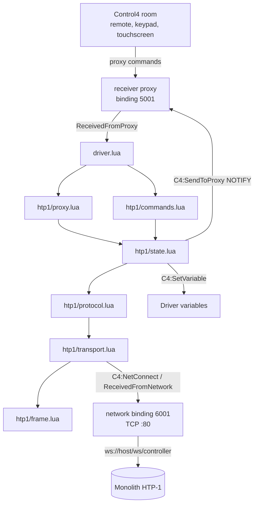

# System Design & Architecture

> Approved by the owner on 2026-08-04. Written into `docs/ai/design/` rather than the
> `docs/superpowers/specs/` default, to match this repository's AI DevKit lifecycle convention.

## Architecture Overview

The driver is a Control4 DriverWorks device presenting the HTP-1 through the stock `receiver` proxy.
It holds one persistent WebSocket to the unit and is entirely event-driven: it never polls.



### Technology choices

**WebSocket, not polling.** The unit exposes no REST API — `/api`, `/mso` and `/status` all return
404, and `GET /` serves the web UI. The control websocket is the only path. It is also the right one:
a 90-second idle observation on 2026-08-04 recorded exactly one message (the `getmso` reply) and zero
bytes afterwards. All state arrives as pushes.

**A purpose-built WebSocket client, not Snap One's `module/websocket.lua`.** DriverWorks has no
native WebSocket API — a scan of all 147 drivers in the local Control4 library found zero
`C4:*WebSocket*` calls; they use `C4:CreateNetworkConnection` with `C4:NetConnect` for raw TCP.
Snap One's library works, but `require`s `global/handlers.lua` (776 lines), `global/timer.lua` and
`module/metrics.lua` — about 1,750 lines of framework this driver needs none of. `global/handlers.lua`
takes ownership of the driver entry points, which is the documented foot-gun from the Control4-HA
work, and the library carries two recorded defects (a socket cache keyed on URL that ignores new
options, and a `delete()` that leaves a zombie killing the live connection) plus `C4:Statsd*`
telemetry. Writing the client is viable here specifically because the endpoint is `ws://`: no TLS,
which is where hand-rolled clients normally fail.

**A projected state model, not a full MSO mirror.** The document is ~38 KB of JSON. Mirroring it
would be roughly ten times the memory per instance, and there are two instances on one controller.
The driver keeps ~25 whitelisted paths.

## Data Models

### Protocol

Text frames of `verb[ space JSON ]` over `ws://<host>/ws/controller` (port 80, no authentication).

| Direction | Message | Meaning |
|---|---|---|
| → | `getmso` | Request the full document |
| ← | `mso {…}` | Full document, ~38 KB |
| → | `changemso [ops]` | Apply RFC 6902 JSON-patch operations |
| ← | `msoupdate [ops]` | State changed — from any source, including the front panel |
| ← | `error "bad-verb"` | Rejected input; the connection stays open |

Verified 2026-08-04 against firmware 1.13.3 and 2.1.1: WebSocket ping frames are answered with pong;
three concurrent controller connections are each served independently, so the driver will not fight
the web UI, the phone app or a second controller; a clean close reconnects without issue.

### Projected state

Whitelisted path prefixes, ~25 of the document's several thousand:

`/volume` · `/muted` · `/powerIsOn` · `/powerAction` · `/input` ·
`/inputs/*/label` · `/inputs/*/visible` · `/upmix/select` · `/loudness` · `/night` · `/dialogEnh` ·
`/bassenhance` · `/cal/diracactive` · `/cal/currentdiracslot` · `/cal/vpl` · `/cal/vph` ·
`/cal/zeroPoint` · `/cal/lipsync` · `/status/*` · `/videostat/*` · `/svronly/macroNames` ·
`/svronly/<macro keys>` · `/versions/*` · `/unitname`

Patch operations are prefix-matched and discarded before any allocation. Value domains, read from the
web UI source and confirmed against both units:

| Path | Domain |
|---|---|
| `/volume` | integer dB, clamped to `[cal.vpl, cal.vph]` (−50…0 on both units, user-configurable) |
| `/muted` | boolean |
| `/powerIsOn` | boolean; `/powerAction` is `"none"` / `"off"` / `"sleep"` / `"reboot"` |
| `/input` | `h1`–`h8`, `a1`, `a2`, `spdif1`–`3`, `optical1`–`3`, `aes`, `b`, `tv`, `usb`, `roon` |
| `/upmix/select` | `off`, `native`, `dolby`, `dts`, `auro`, `mono`, `stereo` |
| `/loudness`, `/bassenhance` | `"off"` / `"on"` |
| `/night` | `"off"` / `"auto"` / `"on"` |
| `/dialogEnh` | integer 0–6 |
| `/cal/diracactive` | `"off"` / `"on"` / `"bypass"` |
| `/cal/currentdiracslot` | integer 0–6 |

### Macros

`svronly/<key>` stores a macro as an array of JSON-patch operations; `svronly/macroNames` maps keys to
user-chosen names. Executing a macro means replaying its stored operations — the same thing the web UI
does. The driver reads both, offers the names in Composer, and fires one by sending its operations as
a single `changemso`.

## API Design

### Control4 surface

Proxy: `receiver` on binding 5001. The proxy addresses inputs and outputs **by connection binding ID**
(`tParams.INPUT` is a connection id such as `3000`; `tParams.OUTPUT` is the type-7 end-point) — read
directly from the unencrypted Lua of SnapAV's `episode-mini-5.1d-200` driver, which is the first-party
reference for this proxy. The connection table is therefore the input map.

| ID | Type | Name | MSO key |
|---|---|---|---|
| 6001 | 4 — network TCP :80 | HTP-1 Control | — |
| 5001 | 2 — RECEIVER | receiver proxy | — |
| 1000–1007 | 6 — AV in, HDMI | HDMI Input 1–8 | `h1`–`h8` |
| 1008 (hidden) | 6 — AV in, HDMI | HDMI eARC from display | `tv` |
| 3008 | 6 — audio in, virtual | eARC audio | `tv` |
| 3000–3001 | 6 — audio in, STEREO | Analog 1–2 | `a1`, `a2` |
| 3002–3004 | 6 — audio in, DIGITAL_COAX | Coax 1–3 | `spdif1`–`spdif3` |
| 3005–3007 | 6 — audio in, DIGITAL_OPTICAL | Optical 1–3 | `optical1`–`optical3` |
| 3009 | 6 — audio in, DIGITAL_COAX | AES/EBU | `aes` |
| 3010 | 6 — audio in, STEREO | Bluetooth | `b` |
| 3011 | 6 — audio in, STEREO | USB Audio | `usb` |
| 2000–2001 | 5 — video out, HDMI | HDMI Output 1–2 | — (mirrored; no per-output state exists) |
| 4000 | 6 — audio out, SPEAKER | Output to amplifiers | — |
| 7000 | 7 — room end-point | `AUDIO_SELECTION` + `AUDIO_VOLUME` | — |

Bluetooth and USB get connections despite having no cable to bind; that is how the proxy makes them
selectable, and it matches the Episode driver's treatment of its Bluetooth input. There is
deliberately no connection for `roon`.

Capabilities: discrete and up/down volume, discrete and toggle mute, discrete input select, discrete
surround-mode select, discrete and toggle loudness. Bass, treble and balance are **False** — the unit
has parametric EQ and bass management, not tone controls, and claiming them puts dead buttons in the
room UI.

`<surround_modes>`, using the vendor's own labels: `1` Direct (`off`), `2` Native (`native`),
`3` Dolby Surround (`dolby`), `4` DTS Neural:X (`dts`), `5` Auro-3D (`auro`), `6` Mono (`mono`),
`7` Stereo (`stereo`).

Properties — read-only: Driver Version, Firmware Version, Serial Number, Model, Connection Status.
Settable: Maximum Volume (dB cap applied above the unit's own `cal.vph`), Volume Ramp Rate (ms per
step, default 100), Power Off Action (`Standby` → `powerAction: "off"`, `Sleep` → `"sleep"`), Adopt Input Labels
From Unit, Debug Mode (Off / On / On for 15 minutes — self-cancelling, so a driver left in debug does
not fill the Director log indefinitely).

Programming commands beyond the proxy's own: Dirac On/Off/Bypass and Select Slot; Loudness
On/Off/Toggle; Night Mode Off/Auto/On; Dialog Enhance 0–6; Bass Enhance On/Off; Lip Sync delay;
Run Macro (list built at runtime from `svronly/macroNames`); Power On/Standby/Sleep/Restart.

Composer actions: Refresh From Device, Rename Inputs From Device Labels, Print Driver State.

Variables, all read-only: `POWER_STATE`, `INPUT_ID`, `INPUT_LABEL`, `VOLUME_DB`, `VOLUME_PERCENT`,
`MUTED`, `SURROUND_MODE`, `DIRAC_STATE`, `DIRAC_SLOT`, `LOUDNESS`, `NIGHT_MODE`, `DIALOG_ENHANCE`,
`BASS_ENHANCE`, `LIP_SYNC_MS`, `INPUT_FORMAT`, `INPUT_PROGRAM`, `OUTPUT_FORMAT`, `SAMPLE_RATE`,
`VIDEO_RESOLUTION`, `VIDEO_COLORSPACE`, `VIDEO_HDR`, `CONNECTED`.

Events, for Control4 programming: `Connected`, `Disconnected`, `Powered On`, `Powered Off`,
`Input Changed`, `Surround Mode Changed`. Each fires only on an actual transition, never on a
redundant `msoupdate`.

### Volume mapping

Control4 rooms work in 0–100; the unit works in whole dB. The driver maps linearly onto
`[cal.vpl, cal.vph]` read live from the unit. Both units currently report −50…0, but the range is
user-configurable, so hardcoding it would silently break the mapping if the owner changed it. The
Maximum Volume property clamps on top of that range.

Percent → dB rounds to the nearest whole dB. The round trip is therefore lossy: with a 50 dB span and
101 percent steps, two adjacent percentages can map to the same dB. The driver treats **dB as the
truth** — `VOLUME_PERCENT` and everything reported to the proxy are derived from the dB value the unit
confirms, never from the percentage that was requested. Otherwise the room's bar and the unit's
display disagree by a step and neither ever wins.

### Internal interfaces

`htp1/transport.lua` is the seam that keeps Snap One's library available as a fallback:

```lua
local t = Transport:new{ host, port, onOpen, onMessage, onClose, onError }
t:connect()   t:send(text)   t:close()
```

Swapping implementations means reimplementing those four functions and touching nothing else.

## Component Breakdown

```
driver.xml
driver.lua            Control4 entry points only — thin dispatch, no logic
htp1/frame.lua        RFC 6455 encode/decode                       [pure Lua]
htp1/protocol.lua     verb layer: getmso / changemso / msoupdate / error   [pure Lua]
htp1/mapping.lua      connection id <-> MSO key, surround ids, volume scale [pure Lua]
htp1/state.lua        projected state + whitelisted JSON-patch applier     [pure Lua]
htp1/transport.lua    WebSocket client: socket, handshake, keepalive, reconnection
htp1/session.lua      orchestration: getmso on open, dispatch, write queue, reconcile
htp1/proxy.lua        receiver proxy handlers and notifications
htp1/commands.lua     Composer actions and programming commands
htp1/log.lua          debug logging with self-cancelling timer
module/json.lua       vendored JSON codec
```

The four modules marked pure Lua hold essentially all the logic that can be wrong and touch no `C4:`
API, so they run under LuaJIT with neither a controller nor a device. `session.lua` takes its
transport by injection, so it tests the same way against a fake.

The split between `transport` and `session` is what makes the seam real: **staying connected is the
transport's job**, so a replacement implementation brings its own reconnection and keepalive rather
than needing the rest of the driver rearranged around it. `session.lua` only ever sees `open`,
`message`, `closed`.

`Sec-WebSocket-Accept` validation is best-effort. `C4:Base64Encode` and `C4:Hash` both appear in
shipped Control4 drivers, but whether `C4:Hash` accepts `"SHA1"` on the target OS is unconfirmed. If
it does, the driver validates; if not, it logs once at debug and accepts a well-formed `101`. The
real assurance that our framing and masking are correct comes from the fake server, which validates
them strictly.

### WebSocket client

Handshake is a `GET /ws/controller HTTP/1.1` upgrade with a random `Sec-WebSocket-Key`, validating the
returned `Sec-WebSocket-Accept` against `base64(SHA1(key .. GUID))` via `C4:Base64Encode` and
`C4:Hash`. Whether `C4:Hash` exposes SHA-1 on the target OS version is confirmed on the first hardware
run; the fallback is accepting a well-formed `101`.

Framing constraints that matter:

- Client-to-server frames **must** be masked with a fresh 4-byte key, or the unit closes the socket.
- `ReceivedFromNetwork` delivers arbitrary TCP chunks. Frames are reassembled in a buffer handling
  partial frames, several frames in one read, and continuation fragments. The 38 KB `mso` frame is the
  stress case and gets dedicated coverage.
- 64-bit payload lengths are parsed, but anything above a 1 MB sanity cap is rejected rather than
  pretending Lua 5.1 can address it.
- Server pings are answered with pong; the driver sends its own ping on the keepalive timer.

### Connection lifecycle

```
OnDriverInit          read properties, build mapping, connect if an address is set
NetworkStatus ONLINE  send the upgrade request
101 accepted          send "getmso" -> project -> announce to proxy -> CONNECTED = true
idle                  ping every 30 s; no pong within 10 s -> declare dead, reconnect
msoupdate             filter -> apply -> notify the proxy only where a value actually changed
disconnect            backoff 2, 4, 8, 16, 30, 60 s, capped, with +/-20 % jitter
```

The jitter is load-bearing: two instances on one controller would otherwise reconnect in lockstep
after every network blip.

### Write path

One outbound queue flushed on a 50 ms timer, in which a new operation **replaces** any queued
operation with the same path rather than appending — the same coalescing the vendor's web client
performs in `filterMatchingCommandType`. This is what keeps a hold-to-ramp from emitting a message per
step.

Each write is applied locally and notified to the proxy immediately, then reconciled against the
unit's confirming `msoupdate`. If no confirmation arrives within 2 seconds the driver re-requests
`getmso` and corrects. Without the optimistic echo the room's volume bar lags the remote; without the
reconciliation the driver can drift from reality.

## Design Decisions

| Decision | Alternatives considered | Rationale |
|---|---|---|
| `receiver` proxy | `amplifier`, or `media_service` + `amplifier` | The earlier Control4-HA volume work proved the amplifier proxy cannot drive a room's on-screen volume readout after ~12 hardware iterations. `receiver` is the proxy Control4 designed for this device class, and SnapAV's Episode driver demonstrates it working. |
| Own WebSocket client | Snap One `module/websocket.lua`; full Snap One framework | ~1,750 lines of unwanted framework, entry-point capture, two recorded defects, Statsd telemetry. `ws://` means no TLS, which removes the usual risk of rolling one's own. Kept behind an interface so the library can still be swapped in. |
| Projected state | Full MSO mirror | ~10× memory per instance, two instances, on a shared controller. Conflicts with the stated resource requirement. |
| Optimistic echo + reconcile | Report only device-confirmed state | Strict confirmation makes every ramp and input switch lag a round trip. Reconciliation bounds the cost of being wrong to 2 seconds. |
| Volume range read from `cal.vpl`/`cal.vph` | Hardcode −50…0 dB | The range is user-configurable on the unit; hardcoding fails silently. |
| Errors logged, never swallowed | Bare `pcall` | This workspace already recorded the pcall trap hiding handler bugs. Handlers are wrapped, but every caught error goes to `C4:ErrorLog` with its traceback. |
| No connection for `roon` | Declare it like any other input | Out of scope by the owner's decision. External selection is reported truthfully with `INPUT = -1`. |

### Open question

Whether the unit keeps its network stack alive when `powerIsOn` is false. Both units report
`fastStart: "on"`, which strongly suggests yes, but confirming requires a write and is deferred to a
supervised session. If it turns out Fast Start is required for `ON` to work, that becomes a documented
prerequisite and the driver warns when the unit reports it off.

## Non-Functional Requirements

**Noise and resource usage.** Steady state is one open TCP socket, one 38 KB read at connect, and a
ping every 30 s. No polling, ever. Outbound writes are coalesced at 50 ms. Debug logging is off by
default and the "On for 15 minutes" setting cancels itself.

**Reliability.** Unattended recovery from unit reboot, network loss and controller restart, with
jittered exponential backoff. Half-open sockets are detected by ping timeout rather than waiting for
TCP. Malformed JSON triggers a fresh `getmso` rather than a crash. Protocol-level `error` replies are
logged and do not drop the connection — the socket demonstrably survives them.

**Firmware tolerance.** 1.13.3 and 2.1.1 differ in real ways beyond the excluded Zone 2 naming
(2.1.1 adds `channeltrim`, `dialnorm`, `shaker`, `lcvc`; 1.13.3 has `vu`). Every read is
absence-tolerant: a missing path disables the feature that needs it rather than erroring. Scrubbed
captures from both versions form the regression fixtures.

**Concurrency.** Two instances on one controller, verified against the unit's demonstrated support for
concurrent controller connections. No shared global state between instances; every timer, socket and
buffer is instance-scoped.

**Security and privacy.** The unit offers no authentication, so the driver adds none — but it also
never writes device identity into logs at default verbosity. No site data enters the repository.

## Testing Strategy

**Tier 1 — pure Lua under LuaJIT** (`tests/run.lua`). `frame`, `state`, `mapping` and `protocol`
tested directly: frame round-trips with masking, all three payload-length encodings, continuation
fragments, frames split across reads, several frames per read, the 38 KB payload, malformed input;
patch add/replace/remove with whitelist filtering; connection-id ↔ MSO-key in both directions; dB ↔
percent round-trip at boundaries and with non-default `vpl`/`vph`; verb parsing including
`error "bad-verb"`. The C4 mock uses varargs throughout, because this workspace recorded that
`C4:SendToProxy` rejects an explicit `nil` call type and a naive mock cannot see it.

**Tier 2 — recorded fixtures.** Real `mso` documents from both firmware versions, scrubbed and
replaced with invented labels, in `tests/fixtures/`. This is the regression suite for firmware
differences.

**Tier 3 — a local fake HTP-1** (`tools/fake-htp1.py`), a Python server speaking the real protocol
from a fixture. It exercises the transport against a genuine socket without touching live units, and
produces on demand the failures hardware will not: mid-frame disconnects, half-open sockets,
byte-at-a-time delivery, a unit that stops answering pings.

**Hardware.** Read-only observation now; writes only in a session where the owner has asked.

## Packaging and Delivery

`tools/build-c4z.ps1` produces `build/Monolith.HTP1.c4z` containing `driver.xml`, `driver.lua`,
`htp1/*.lua` and `module/json.lua` — nothing else. `docs/`, `tests/`, `tools/`, `.ai-devkit.json`,
`.claude/`, `CLAUDE.md`, `.vscode/` and `build/` are excluded, and the script prints the resulting
archive layout so the gate produces evidence rather than an assertion. The Composer display name is
"Monolith HTP-1". No custom device artwork in v1; the `receiver` proxy supplies Composer's icon.

| Milestone | Contents |
|---|---|
| M1 Core | transport, protocol, state, receiver proxy: power, input select, discrete volume, hold-to-ramp, mute, surround mode, reconnection |
| M2 Feedback | variables, `status` / `videostat`, input-label adoption, events |
| M3 Extras | Dirac, loudness, night, dialog enhance, bass enhance, lip sync, macros |
| M4 Hardening | fault injection against the fake server, both-firmware fixture regression, docs, release build |

M1 is the milestone needing Composer time from the owner; M2 and M3 largely ride on it.

The implementation plan is written **per milestone**, starting with M1, rather than as one plan
spanning all four. M1 carries every unresolved risk — the framing code, the `C4:Hash` question, the
power-in-standby question — and what it teaches should shape M2 onward rather than being guessed at
now.
